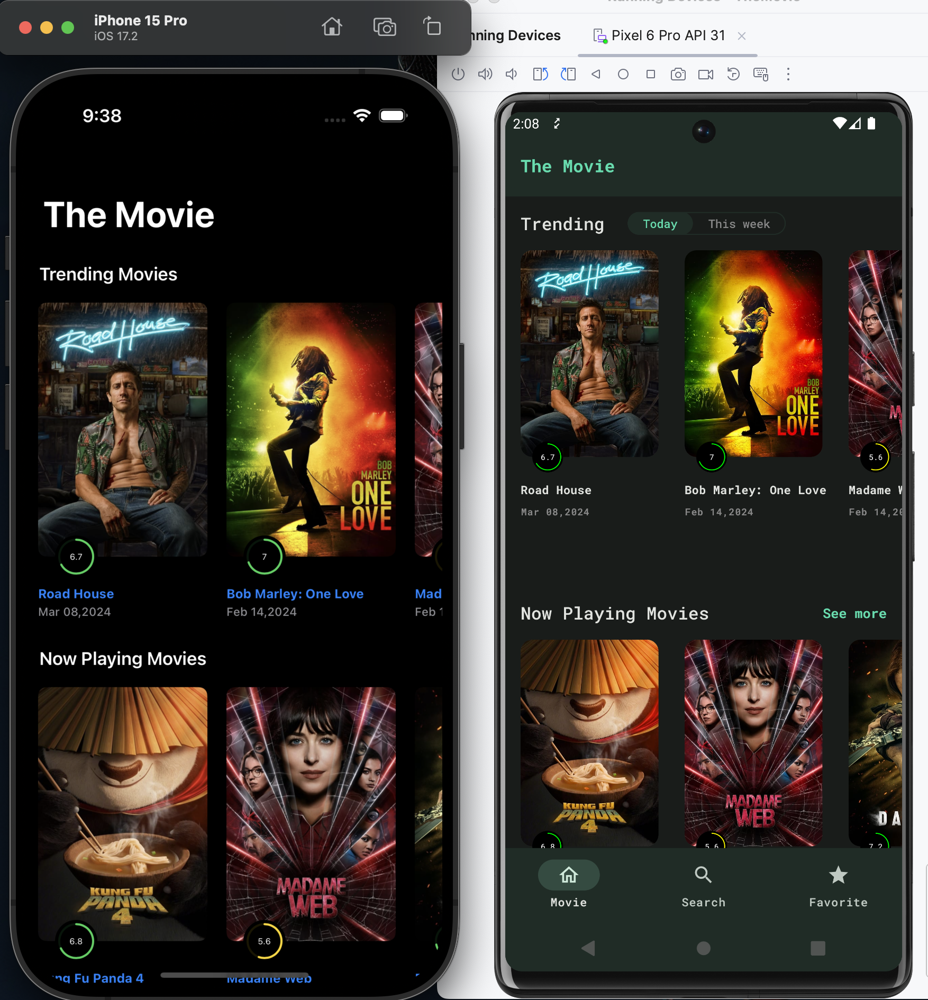
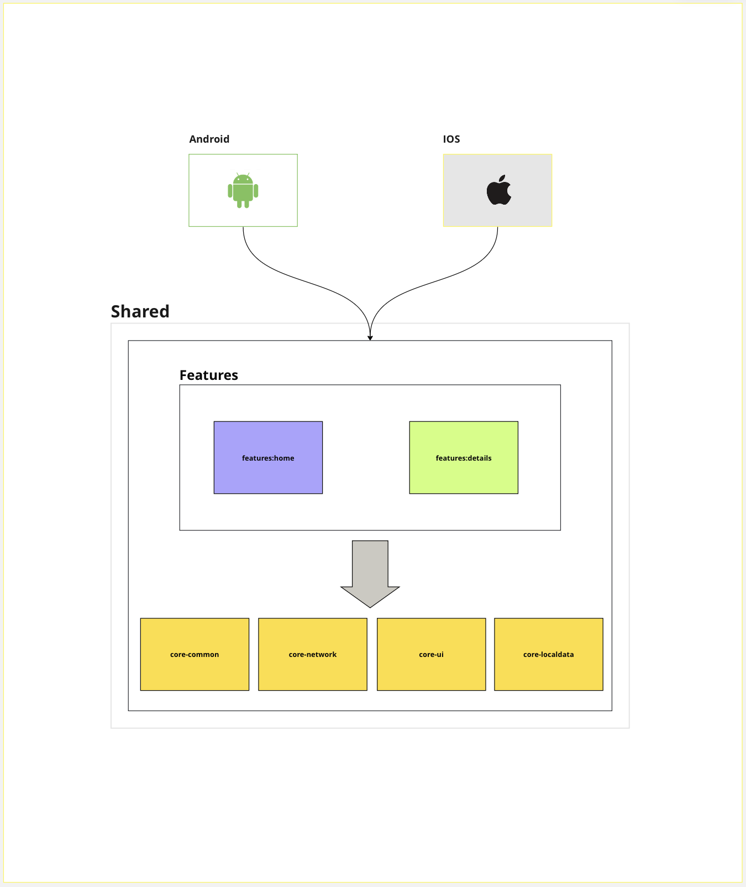

# The Movie (Kotlin Multiplatform Mobile)

This is a simple movie application built to demostrate the ussage of Kotlin Multiplatform Mobile (KMM). It includes iOS and Android applications with a native UI Swift UI and Jetpack compose, a module with code shared on iOS and Android.

Demostrated the expect and actual for different platforms specific logic. Example:

*  LocalDataManager (core-localdata) in that module Android is using **EncryptedSharedPreference** and IOS is using **NSUserDefault** to store keyValue data.

## Screenshots

## About

Application has two screens, home page and movie details. Home page diplaying various type movies and details page present for details of the specific movie. The data come though via network using REST API.

## Installation and Start

* **Android**
Firstly need to install [KMMM Android Studio Plugin](https://plugins.jetbrains.com/plugin/14936-kotlin-multiplatform-mobile). And can change target with composeApp and run.

* **IOS**
Firstly need to install XCode. And then open the iosApp.xcodeproj under in iosApp folder like normal ios project. 

## Architecture

* Clean Architecture and Repository pattern
* Umbrella KMM modularization 

_Diagram_

## Tech Stacks

* [Ktor Multiplatform](https://ktor.io/docs/getting-started-ktor-client-multiplatform-mobile.html),  used for IOS and Android networking.
* [Kotlin Serialization](https://kotlinlang.org/docs/serialization.html), used for data converting process across the module.
* [Kotlin Coroutine](https://github.com/Kotlin/kotlinx.coroutines/blob/master/README.md), used for concurrency for IOS and Android.
* [Koin](https://insert-koin.io/docs/reference/koin-mp/kmp/), used for Dependecny injection.
* [KotinTest](https://www.jetbrains.com/help/kotlin-multiplatform-dev/multiplatform-run-tests.html#test-a-simple-multiplatform-project), used for unitest.
 and much more. Please look at the build.gradle.kts in shared module.

##  Opensource API

The Movie app is using the the [TMDB](https://www.themoviedb.org/documentation/api) for construction RESTful API.
The Movie Database (TMDb) is a community built movie and TV database. Every piece of data has been added by our amazing community dating back to 2008. TMDb's strong international focus and breadth of data is largely unmatched and something we're incredibly proud of. Put simply, we live and breathe community and that's precisely what makes us different.

Learn more about [Kotlin Multiplatform](https://www.jetbrains.com/help/kotlin-multiplatform-dev/get-started.html),
[Compose Multiplatform](https://github.com/JetBrains/compose-multiplatform/#compose-multiplatform).

## MIT License

 
Copyright (c) 2024 deeheinhtet

Permission is hereby granted, free of charge, to any person obtaining a copy
of this software and associated documentation files (the "Software"), to deal
in the Software without restriction, including without limitation the rights
to use, copy, modify, merge, publish, distribute, sublicense, and/or sell
copies of the Software, and to permit persons to whom the Software is
furnished to do so, subject to the following conditions:

The above copyright notice and this permission notice shall be included in all
copies or substantial portions of the Software.

THE SOFTWARE IS PROVIDED "AS IS", WITHOUT WARRANTY OF ANY KIND, EXPRESS OR
IMPLIED, INCLUDING BUT NOT LIMITED TO THE WARRANTIES OF MERCHANTABILITY,
FITNESS FOR A PARTICULAR PURPOSE AND NONINFRINGEMENT. IN NO EVENT SHALL THE
AUTHORS OR COPYRIGHT HOLDERS BE LIABLE FOR ANY CLAIM, DAMAGES OR OTHER
LIABILITY, WHETHER IN AN ACTION OF CONTRACT, TORT OR OTHERWISE, ARISING FROM,
OUT OF OR IN CONNECTION WITH THE SOFTWARE OR THE USE OR OTHER DEALINGS IN THE
SOFTWARE.

